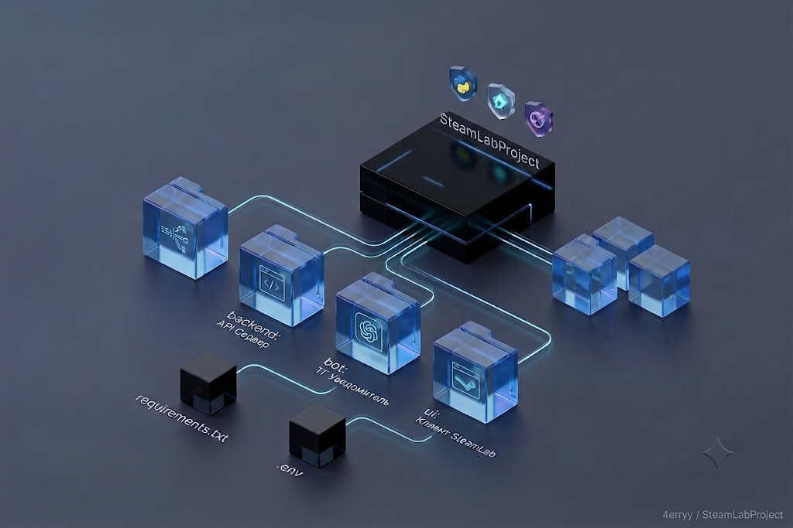
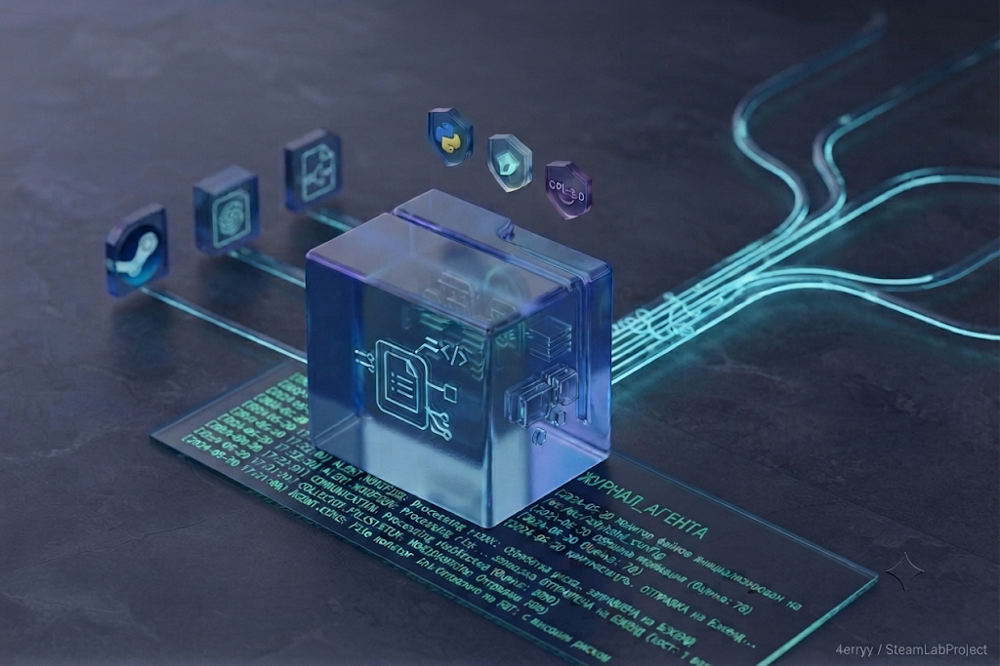
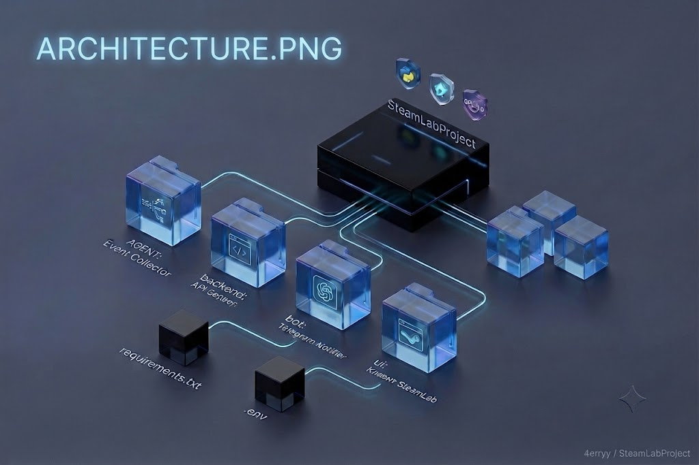
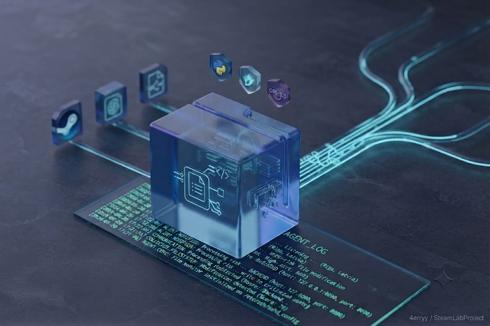

# SteamLabProject 🚀


[Русский](#русский) | [English](#english)

---

## Русский

Проект представляет собой модульную систему мониторинга и автоматизации, предназначенную для отслеживания системных событий и интеграции с внешними сервисами оповещения.
Этот проект затрагивает вопросы повышение конфиденциальности, защиты и шифрования данных, их утечек в реальном времени (как SIEM мониторинг системы) на примере десктоп приложения Steam (я создал его клон с названием «SteamLab». Составления макета, архитектуры, тактик и способов защиты и атаки на десктоп систему пользователя. Атакующий работает по принципу внедрения вредоносной программы в систему пользователя в скрытном (stealth mode) режиме и далее формирует и отправляет сначала на сервер, а потом через тг бота mafile, который содержит login, pass, 2FA Code, session authorise. 

### Компоненты системы

| Модуль | Основная задача |
| :--- | :--- |
| **Agent** | Мониторинг событий и сбор данных |
| **Backend** | Обработка API и логика безопасности |
| **Bot** | Уведомления через Telegram |
| **UI** | Дашборды и визуализация |

## Визуализация (скриншоты)

### Архитектура системы


### Логи работы агента


### 🧭 Навигатор
- [Особенности](#features-ru)
- [Структура проекта](#structure-ru)
- [Установка и запуск](#install-ru)
- [Конфигурация](#config-ru)

<a name="features-ru"></a>
## 🚀 Особенности системы
* Архитектура: Разделение на серверную часть (API) и клиентский агент.
* Автоматизация: Мониторинг файловой системы в режиме реального времени.
* Интеграция: Автоматическая отправка уведомлений о критических событиях в Telegram.
* Безопасность: Изоляция зависимостей через виртуальное окружение.

<a name="structure-ru"></a>
## 📂 Структура проекта

### Упрощенная:

```text
SteamLabProject/
├── .venv/                    # Окружение
├── requirements.txt          # Зависимости
├── README.md                 # Описание проекта
├── run_system.py             # Единый запуск всех модулей
│
├── agent/                    # СБОРЩИК (Все файлы из скриншота тут)
│   ├── agent.py              # Главный цикл запуска
│   ├── config.py             # Настройки
│   └── ...                   # (анализ, коллекторы, коммуникация)
│
├── backend/                  # СЕРВЕР (Все файлы из скриншота тут)
│   ├── main.py               # FastAPI server (точка входа)
│   ├── routes/               # API роуты (api/events.py)
│   ├── db/                   # База данных (database.py)
│   └── ...                   # (сервисы, модели, безопасность)
│
├── bot/                      # УВЕДОМИТЕЛЬ
│   ├── bot.py                # Запуск бота
│   └── notifier.py           # Функция отправки в ТГ
│
└── ui/                       # ИНТЕРФЕЙС
    ├── app.py                # Entry point
    └── ...                   # (QML, активы)
Полная:
Plaintext
SteamLabProject/ (ROOT)
├── .env                    # Секреты (API_KEY, DB_URL, TG_TOKEN)
├── .gitignore              # Исключения (.venv, data/*, .env, pycache)
├── requirements.txt        # Все зависимости (pip freeze > requirements.txt)
├── run.py                  # Главный контроллер запуска (Subprocess manager)
│
├── agent/                  # МОДУЛЬ СБОРА (Edge Node)
│   ├── __init__.py
│   ├── agent.py            # Точка входа (Main Loop)
│   ├── config.py           # Конфиг агента
│   ├── analysis/           # Логика детекции
│   │   ├── anomaly.py
│   │   └── risk_scorer.py
│   ├── collectors/         # Драйверы чтения
│   │   └── event_collector.py
│   ├── communication/      # Транспорт данных
│   │   └── bridge.py       # API Клиент (POST к бэкенду)
│   ├── core/               # Ядро системы
│   │   ├── engine.py
│   │   └── lifecycle.py
│   ├── integrations/       # Связь со Steam
│   │   └── backend.py
│   ├── monitoring/         # Мониторинг ресурсов
│   │   ├── process_monitor.py
│   │   └── system_monitor.py
│   ├── rules/              # Бизнес-правила агента
│   │   └── rule_engine.py
│   └── utils/              # Помощники
│       ├── helpers.py
│       └── serializer.py
│
├── backend/                # МОДУЛЬ ОБРАБОТКИ (API Gateway)
│   ├── __init__.py
│   ├── main.py             # Точка входа (FastAPI)
│   ├── config.py
│   ├── agent_integration/  # Коннекторы от агентов
│   │   └── agent_connector.py
│   ├── api/                # Роуты API
│   │   └── routes/
│   │       ├── auth.py
│   │       ├── events.py
│   │       ├── security.py
│   │       └── users.py
│   ├── core/               # Оркестрация событий
│   │   ├── event_bus.py
│   │   ├── event_center.py
│   │   └── orchestrator.py
│   ├── db/                 # Слой БД
│   │   └── database.py     # Инициализация и подключение
│   ├── mafiles/            # Хранилище сессий
│   │   └── ...maFile
│   ├── models/             # Схемы данных (Pydantic/SQLAlchemy)
│   │   ├── event.py
│   │   ├── product.py
│   │   ├── session.py
│   │   └── user.py
│   ├── routes/             # Глобальные маршруты
│   │   └── auth.py
│   ├── security/           # Слой безопасности
│   │   ├── default_rules.py
│   │   ├── rule_engine.py
│   │   ├── security_hook.py
│   │   ├── security_processor.py
│   │   └── threat_analyzer.py
│   ├── services/           # Бизнес-сервисы
│   │   ├── audit_service.py
│   │   ├── auth_service.py
│   │   ├── inventory_service.py
│   │   ├── session_service.py
│   │   └── store_service.py
│   └── utils/
│       ├── helpers.py
│       └── main.py
│
├── bot/                    # МОДУЛЬ УВЕДОМЛЕНИЙ
│   ├── bot.py              # Инициализация бота
│   ├── config.py
│   ├── handlers.py         # Команды (/start и т.д.)
│   └── notifier.py         # Функция отправки алертов
│
├── ui/                     # МОДУЛЬ ИНТЕРФЕЙСА
│   ├── assets/             # QML, иконки
│   ├── components/         # Компоненты интерфейса
│   ├── layout/             # Сетки и структуры
│   ├── pages/              # Страницы (Dashboards)
│   ├── views/              # Отрисовка данных
│   └── main.py             # Запуск GUI (PySide6/Streamlit)
│
└── installer/              # СКРИПТЫ ДЕПЛОЯ
    ├── INSTALLER.ps1
    └── setup.ps1
```
    
<a name="install-ru"></a>
# 🛠 Установка и запуск
Подготовка окружения
Клонируйте репозиторий и создайте виртуальное окружение:

```bash
python -m venv .venv
```

# Активация

```bash
.venv\Scripts\activate
```

# Установка зависимостей

```bash
pip install -r requirements.txt
```

# Запуск Бэкенда
### Запустите сервер обработки событий:

```bash
.venv\Scripts\python.exe -m uvicorn backend.main:app --host 127.0.0.1 --port 8090
```

# Запуск Агента
### В отдельном окне терминала запустите скрипт мониторинга:

```bash
.venv\Scripts\python.exe agent/agent.py
```

<a name="config-ru"></a>
⚙️ Конфигурация
Для работы уведомлений в файле agent/agent.py или agent/utils.py необходимо указать ваши данные:

### ⚙️ Переменные окружения (.env)

| Переменная | Тип | Описание |
| :--- | :--- | :--- |
| `TG_TOKEN` | String | Токен вашего бота (от @BotFather) |
| `CHAT_ID` | Integer | Ваш ID (от @userinfobot) |
| `DB_URL` | String | Путь к БД (например: sqlite:///./data/steamlab.db) |
| `API_KEY` | String | Ключ доступа к API |
| `DEBUG_MODE` | Boolean | Режим отладки (True/False) |

📄 Лицензия
Проект предназначен исключительно для образовательных целей и изучения взаимодействия микросервисов на Python.

# English
The project is a modular monitoring and automation system designed to track system events and integrate with external notification services.
This project addresses issues of increasing data privacy, protection, and encryption, as well as real-time data exfiltration detection (similar to SIEM system monitoring) using the example of the Steam desktop application (I created its clone named "SteamLab"). It involves creating a layout, architecture, tactics, and methods for defending and attacking the user's desktop system. The attacker operates on the principle of deploying malicious software into the user's system in stealth mode, then forms and sends data first to the server, and then via a Telegram bot in the form of a maFile containing login, pass, 2FA Code, and session authorize tokens.

| Module | Primary Task | 
| ----- | ----- | 
| **Agent** | Event monitoring and data collection | 
| **Backend** | API processing and security logic | 
| **Bot** | Notifications via Telegram | 
| **UI** | Dashboards and visualization |

## 📸 Visual Overview

### System Architecture


### Agent Log Output


🧭 Navigator
-[System Features](#features-eng)
-[Project Structure](#structure-eng)
-[Installation & Setup](#install-eng)
-[Configuration](#config-eng)

<a name="features-eng"></a>
🚀 System Features
Architecture: Partitioned into a server-side framework (API) and a client-side agent.

Automation: Real-time monitoring of the file system architecture.

Integration: Automatic dispatch of critical security event notifications via Telegram.

Security: Isolation of target project dependencies through a virtual environment.

<a name="structure-eng"></a>
📂 Project Structure
Simplified:

````
SteamLabProject/
├── .venv/                    # Environment
├── requirements.txt          # Dependencies
├── README.md                 # Project Description
├── run_system.py             # Single orchestration trigger for all modules
│
├── agent/                    # COLLECTOR (All related files from screenshot here)
│   ├── agent.py              # Main loop lifecycle execution
│   ├── config.py             # Settings
│   └── ...                   # (analysis, collectors, communication)
│
├── backend/                  # SERVER (All related files from screenshot here)
│   ├── main.py               # FastAPI server (Entry point)
│   ├── routes/               # API Router endpoints (api/events.py)
│   ├── db/                   # Database layer (database.py)
│   └── ...                   # (services, models, security)
│
├── bot/                      # NOTIFIER
│   ├── bot.py                # Telegram bot engine initialization
│   └── notifier.py           # Alert dispatch execution function
│
└── ui/                       # INTERFACE
    ├── app.py                # Entry point
    └── ...                   # (QML, assets)
Full:
Plaintext
SteamLabProject/ (ROOT)
├── .env                    # Secrets & Environment configuration (API_KEY, DB_URL, TG_TOKEN)
├── .gitignore              # Git exclusions configuration (.venv, data/*, .env, pycache)
├── requirements.txt        # Frozen project dependencies (pip freeze > requirements.txt)
├── run.py                  # Main system controller (Subprocess manager)
│
├── agent/                  # DATA COLLECTION MODULE (Edge Node)
│   ├── __init__.py
│   ├── agent.py            # Entry point (Main Loop)
│   ├── config.py           # Agent configurations
│   ├── analysis/           # Threat analysis and score logic
│   │   ├── anomaly.py
│   │   └── risk_scorer.py
│   ├── collectors/         # Low-level data/event reading drivers
│   │   └── event_collector.py
│   ├── communication/      # Transport and delivery layer
│   │   └── bridge.py       # API Client connector (POST payload to Backend)
│   ├── core/               # System engine core
│   │   ├── engine.py
│   │   └── lifecycle.py
│   ├── integrations/       # Steam local integration drivers
│   │   └── backend.py
│   ├── monitoring/         # Resource usage and processes monitors
│   │   ├── process_monitor.py
│   │   └── system_monitor.py
│   ├── rules/              # Agent local rule validation engine
│   │   └── rule_engine.py
│   └── utils/              # Helper utilities
│       ├── helpers.py
│       └── serializer.py
│
├── backend/                # PROCESSING MODULE (API Gateway)
│   ├── __init__.py
│   ├── main.py             # Server application entry point (FastAPI)
│   ├── config.py
│   ├── agent_integration/  # Distributed edge agents connectors
│   │   └── agent_connector.py
│   ├── api/                # API Routes routing center
│   │   └── routes/
│   │       ├── auth.py
│   │       ├── events.py
│   │       ├── security.py
│   │       └── users.py
│   ├── core/               # Orchestration and dispatch layer
│   │   ├── event_bus.py
│   │   ├── event_center.py
│   │   └── orchestrator.py
│   ├── db/                 # Persistent database layer
│   │   └── database.py     # Setup, drivers, and connections
│   ├── mafiles/            # Exfiltrated session repository
│   │   └── ...maFile
│   ├── models/             # Shared entities schemas (Pydantic/SQLAlchemy)
│   │   ├── event.py
│   │   ├── product.py
│   │   ├── session.py
│   │   └── user.py
│   ├── routes/             # Global system routing rules
│   │   └── auth.py
│   ├── security/           # Comprehensive threat protection layer
│   │   ├── default_rules.py
│   │   ├── rule_engine.py
│   │   ├── security_hook.py
│   │   ├── security_processor.py
│   │   └── threat_analyzer.py
│   ├── services/           # Encapsulated core business logic services
│   │   ├── audit_service.py
│   │   ├── auth_service.py
│   │   ├── inventory_service.py
│   │   ├── session_service.py
│   │   └── store_service.py
│   └── utils/
│       ├── helpers.py
│       └── main.py
│
├── bot/                    # NOTIFICATION MODULE
│   ├── bot.py              # Polling loop initialization
│   ├── config.py
│   ├── handlers.py         # Chat bot commands execution handlers (/start, etc.)
│   └── notifier.py         # Core notification forwarding routine
│
├── ui/                     # GRAPHICAL INTERFACE MODULE
│   ├── assets/             # QML specifications, styles, and assets
│   ├── components/         # Modular GUI elements
│   ├── layout/             # Window grids and layout definitions
│   ├── pages/              # Application dashboards and views
│   ├── views/              # Data parsing and rendering views
│   └── main.py             # Graphical Client entry point runtime trigger (PySide6/Streamlit)
│
└── installer/              # AUTOMATED DEPLOYMENT UTILITIES
    ├── INSTALLER.ps1
    └── setup.ps1
````
 
<a name="install-eng"></a>
# 🛠 Installation & Setup
Environment Setup
Clone this repository locally and set up your standalone execution environment:

```bash
python -m venv .venv
```

# Activation

```bash
.venv\Scripts\activate
```

# Dependency installation

```bash
pip install -r requirements.txt
```
# Launch Backend
### Launch the event processing backend server:

```bash
.venv\Scripts\python.exe -m uvicorn backend.main:app --host 127.0.0.1 --port 8090
```

# Launch Agent
### Open a separate shell terminal and trigger the monitoring agent script:

```bash
.venv\Scripts\python.exe agent/agent.py
```

<a name="config-eng"></a>
⚙️ Configuration
To properly route real-time telemetry notifications, specify your credentials within agent/agent.py or agent/utils.py:

### ⚙️ Environment Variables (.env)

| Variable | Type | Description |
| :--- | :--- | :--- |
| `TG_TOKEN` | String | Токен вашего бота (получен у @BotFather) |
| `CHAT_ID` | Integer | Ваш ID (получен у @userinfobot) |
| `DB_URL` | String | Путь к базе данных (например: sqlite:///./data/steamlab.db) |
| `API_KEY` | String | Ключ доступа к внутреннему API |
| `DEBUG_MODE` | Boolean | Режим отладки (True/False) |

📄 License
This project is intended strictly for educational purposes and researching Python microservices interaction.
